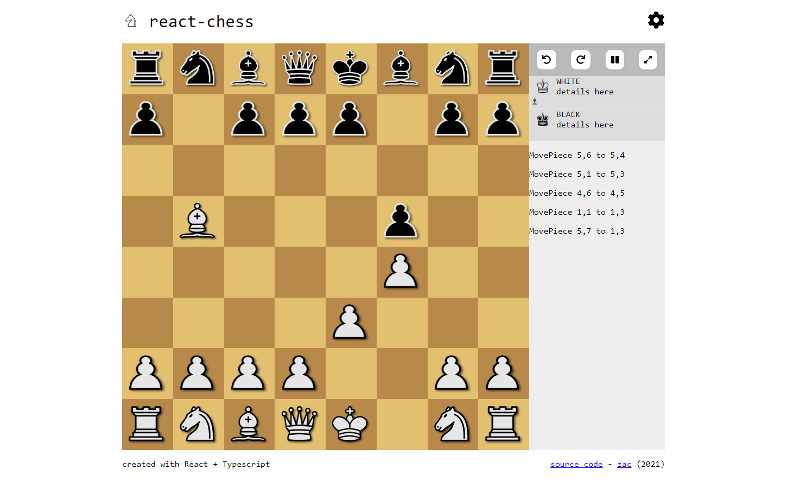

# react-chess

  

Play online at [zaccnz.github.io/react-chess/](https://zaccnz.github.io/react-chess/)  

### Todo

- [x] Gameplay
  - [x] Get basic chess gameplay running
  - [x] Game timer
  - [x] Reset board, undo button, etc (QoL)
  - [x] Ensure game is responsive and can be played on phone with touch
- [x] Website design
  - [x] Complete layout
  - [x] Complete light and dark themes
  - [x] Cleanup UI
  - [x] Smooth piece movement (including undo & redo actions)
- [ ] Chess AI (human vs bot match)
  - [x] Minmax
  - [x] Alpha-beta pruning
  - [ ] Move ordering
  - [ ] Improve evaluations
  - [x] Move into worker
  - [ ] Optimizations
- [x] Multiplayer (human vs human)
  - [x] Allow players to create and join lobbies
  - [x] Synchronize gameplay between clients
- [x] Host project online

### Libraries used
This project is built with  
- React
- Vite
- [chess.js](https://github.com/jhlywa/chess.js)
- TypeScript
- Styled Components
- FontAwesome
- React Router Dom
- fscreen
- UUID

Chess pieces from [OpenGameArt](https://opengameart.org/content/chess-pieces-and-board-squares).  
Bot logic inspired by [freeCodeCamp Step-by-step Chess AI](https://www.freecodecamp.org/news/simple-chess-ai-step-by-step-1d55a9266977/).  


### Building

To run this project locally  
```
git clone https://github.com/zaccnz/react-chess.git
cd react-chess
npm install
npm run dev
```
  
You can also build this project...  
```
npm run build
```
then host it on GitHub pages  
```
npm run deploy
```
